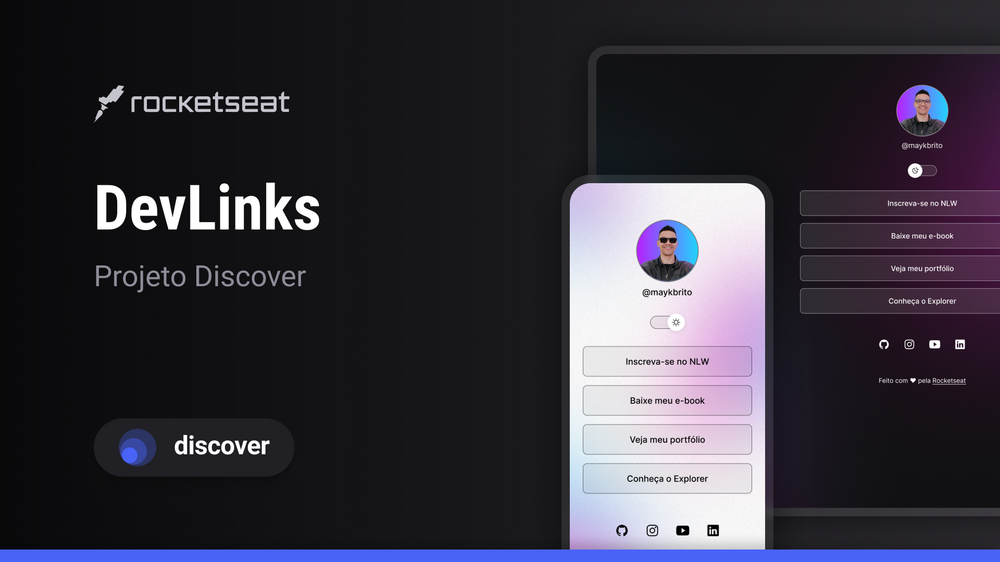

<h1 align="center">Devlinks</h1>

Programa exclusivo e gratuito, promovido pela Rocketseat para ensino de tecnologias WEB

<a href="#-tecnologias">Tecnologias</a>&nbsp;&nbsp;&nbsp;|&nbsp;&nbsp;&nbsp;
<a href="#-Projeto">Projeto</a>&nbsp;&nbsp;&nbsp;|&nbsp;&nbsp;&nbsp;
<a href="#-layout">Layout</a>&nbsp;&nbsp;&nbsp;|&nbsp;&nbsp;&nbsp;
<a href="#-licença">Licenças</a>

    

    
 

## 🚀 Tecnologias
Esse projeto foi desenvolvido com as seguintes tecnologias:

- HTML e CSS
- JavaScript
- Git e Github
- Figma

## 💻 Projeto
O DevLinks é um agregador de links para usar como cartão de visitas online.

## 🔖 Layout
Você pode visualizar o layout do projeto através [DESSE LINK](https://www.figma.com/design/mMRZhDEgUjst6sSOoyzy4L/DevLinks-%E2%80%A2-Projeto-Discover--Community-?node-id=0-1&p=f&t=mqRyndhtWjumdWz2-0). É necessário ter conta no [Figma](https://figma.com) para acessá-lo.

## 📝 Licença
Esse projeto está sob a licença MIT.

Feito com ♥ by Rocketseat 👋 Participe da nossa comunidade!